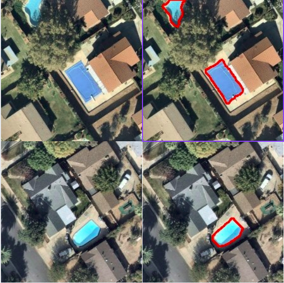
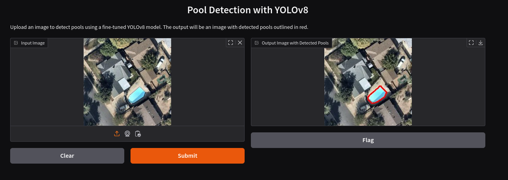

# 🏊 Swimming Pool Detection using YOLOv8

## 📌 Project Overview
This project aims to **detect swimming pools in aerial images** using **YOLOv8 segmentation**.  
The model is trained to **identify pools of any shape** and output their exact boundaries.

### 🔹 **Input**
- A single **aerial image** (`.jpg`, `.png`, etc.)

### 🔹 **Output**
- **coordinates.txt** → Detected pool boundary coordinates.
- **output_image.jpg** → Image with **red outlines** around pools.

---

## 📂 **Project Structure**
```
├── pool_detect.py        # Command-line script for pool detection
├── requirements.txt      # Required Python packages
├── server.py             # (Optional) API server for pool detection
├── test_images/          # Sample test images
│   ├── test1.jpg
│   ├── test2.jpg
│   ├── test3.jpg
│   ├── test4.jpg
│   └── test5.jpg
├── weights/
│   └── best.pt           # Trained YOLOv8 model weights
├── output_image.jpg      # Result of running pool_detect.py on test1.jpg
├── coordinates.txt       # Polygon coordinates of detected pools in test1.jpg
```

---

## 📦 **Installation & Setup**
### **1️⃣ Create a Virtual Environment**
```bash
python -m venv pool_venv
source pool_venv/bin/activate  # On Linux/Mac
pool_venv\Scripts\activate     # On Windows
```

### **2️⃣ Install Dependencies**
```bash
pip install -r requirements.txt
```
* or manually install the requiremnets *  
```bash
pip install ultralytics opencv-python numpy
```

---

## 🏋 **Model Training**
The model was trained using **YOLOv8n-seg (segmentation model)** from the **Ultralytics** library.

### 🔹 **Dataset Preparation**
- **Labeled dataset** using **Roboflow** with **polygon annotations**
- **Split the dataset** into:
  - **Train** → 70%
  - **Validation** → 20%
  - **Test** → 10%
- Exported the dataset in **YOLOv8 segmentation format**.

### 🔹 **Training the Model**
```python
from ultralytics import YOLO

# Load YOLOv8 segmentation model
model = YOLO("yolov8n-seg.pt")

# Train the model
model.train(data="data.yaml", epochs=50, imgsz=640, device="cpu", batch=8, workers=4)
```
- The best model weights are saved in:
  ```
  runs/segment/train/weights/best.pt
  ```
- **Final model stored in `weights/best.pt`.**

---

## 🚀 **Running the Pool Detection Script**
To detect pools in an image, use the following command:
```bash
python pool_detect.py test_images/test1.jpg
```
### 🔹 **Script Explanation (`pool_detect.py`)**
1. **Loads the trained model (`weights/best.pt`)**.
2. **Runs inference** on the input image.
3. **Filters detections with confidence ≥ 60%**.
4. **Extracts pool boundary coordinates** and saves them to `coordinates.txt`.
5. **Draws a red outline** around detected pools (no rectangles).
6. **Saves the output as `output_image.jpg`.**

---

## 📊 **Results**
Example before & after pool detection:  


- The script successfully outlines pools **without adding rectangles**.
- **`coordinates.txt`** contains the polygon coordinates of detected pools.

---

## 🌐 **Testing with Gradio**
You can also test the model using a **Gradio interface** by running the following script:
```bash
python gradio_app.py
```
This will launch a web interface where you can upload images and see the pool detection results in real-time.

### 🔹 **Gradio Interface Example**


- The Gradio app provides an easy-to-use interface for testing the model without writing any code.
- Simply upload an image, and the app will display the detected pools with red outlines.

---

## 🌐 **Using the Flask Server**
You can also use the `server.py` script to run a Flask server that takes an image and returns an image with the pool outlined.

### 🔹 **Running the Flask Server**
```bash
python server.py
```

### 🔹 **Using the Flask Server**
Once the server is running, you can send a POST request with an image to the server and receive the processed image in response.

Example using `curl`:
```bash
curl -X POST -F "file=@test_images/test1.jpg" http://127.0.0.1:5000/detect -o output_image.jpg
```

- The server will process the image and return the result with detected pools outlined in red.

---


## 📖 **References**
- **Ultralytics YOLOv8**: [https://github.com/ultralytics/ultralytics](https://github.com/ultralytics/ultralytics)
- **Dataset Source**: [Swimming Pool Detection - Algarve's Landscape](https://www.kaggle.com/datasets/cici118/swimming-pool-detection-algarves-landscape)
- **Roboflow (for labeling)**: [https://roboflow.com/](https://roboflow.com/)

---

